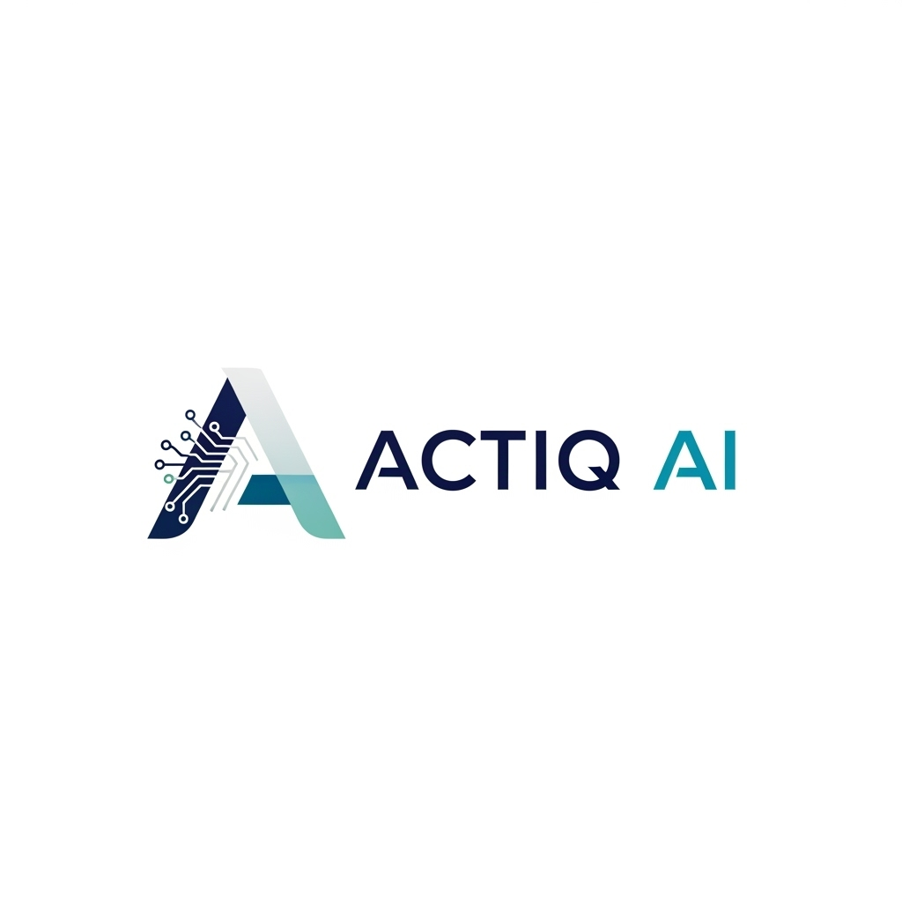

<div align="center">
  
  
  # 🚀 Actiq AI
  
  ### The Internet is Your Canvas
  
  **AI-Powered Meeting Intelligence Platform**
  
  [](https://nextjs.org/)
  [](https://reactjs.org/)
  [](https://www.typescriptlang.org/)
  [](https://tailwindcss.com/)
  [](https://livekit.io/)
  
  [Demo](https://actiqai.vercel.app) · [Documentation](#-documentation) · [Report Bug](https://github.com/zakir19/actiqai/issues) · [Request Feature](https://github.com/zakir19/actiqai/issues)
  
</div>

---

## ✨ What is Actiq AI?

Actiq AI is where teams design and publish stunning meetings. Built for the fast-paced life of modern teams, our AI-powered features eliminate busywork and help you focus on building.

### 🎯 Key Features

- 🎙️ **Real-time Transcription** - Accurate live captions powered by Deepgram
- 🤖 **AI Summaries** - Intelligent meeting summaries using Google Gemini
- 📝 **Note-to-Task AI** - Automatically convert meeting notes into actionable tasks
- 👥 **Speaker Identification** - Know who said what with accurate diarization
- 🎥 **Video Meetings** - High-quality video calls powered by LiveKit
- 💬 **Real-time Chat** - Integrated messaging with Stream Chat
- 📊 **Action Items** - Auto-extract owners, due dates, and next steps
- 🔐 **Enterprise Security** - SOC 2 ready with GDPR compliance
- 🌐 **Global Integrations** - Connect to your favorite tools

---

## 🎨 Screenshots

<div align="center">
  
  <p><em>Beautiful landing page with Framer-style animations</em></p>
  
  
  <p><em>Modern meetings dashboard with stats and analytics</em></p>
  
  
  <p><em>Manage your AI agents with ease</em></p>
</div>

---

## 🏗️ Tech Stack

### Frontend
- **Framework**: Next.js 15 (App Router)
- **Language**: TypeScript 5
- **Styling**: TailwindCSS 4
- **UI Components**: Radix UI + shadcn/ui
- **Animations**: Framer Motion + GSAP
- **State Management**: TanStack Query (React Query)
- **Forms**: React Hook Form + Zod

### Backend
- **API**: tRPC (End-to-end typesafe APIs)
- **Database**: Neon PostgreSQL + Drizzle ORM
- **Authentication**: Better Auth
- **Real-time**: WebSockets + LiveKit
- **Background Jobs**: Inngest
- **AI**: Google Gemini + Deepgram

### Infrastructure
- **Hosting**: Vercel
- **Video**: LiveKit Cloud
- **Chat**: Stream.io
- **Speech-to-Text**: Deepgram
- **Database**: Neon PostgreSQL

---

## 🚀 Getting Started

### Prerequisites

- Node.js 20+ and npm/pnpm/yarn
- PostgreSQL database (or Neon account)
- LiveKit account
- Stream.io account
- Deepgram API key
- Google Gemini API key

### Installation

1. **Clone the repository**
   ```bash
   git clone https://github.com/zakir19/actiqai.git
   cd actiqai
   ```

2. **Install dependencies**
   ```bash
   npm install
   # or
   pnpm install
   # or
   yarn install
   ```

3. **Set up environment variables**
   ```bash
   cp .env.local.example .env.local
   ```
   
   Then fill in your environment variables in `.env.local`:
   ```env
   # Database
   DATABASE_URL=your_neon_database_url
   
   # LiveKit
   LIVEKIT_API_KEY=your_livekit_api_key
   LIVEKIT_API_SECRET=your_livekit_secret
   LIVEKIT_URL=wss://your-livekit-url
   
   # Stream.io
   NEXT_PUBLIC_STREAM_API_KEY=your_stream_api_key
   STREAM_API_SECRET=your_stream_secret
   
   # Deepgram
   DEEPGRAM_API_KEY=your_deepgram_key
   
   # Google Gemini
   GOOGLE_API_KEY=your_gemini_key
   
   # Better Auth
   BETTER_AUTH_SECRET=your_auth_secret
   BETTER_AUTH_URL=http://localhost:3000
   ```

4. **Set up the database**
   ```bash
   npm run db:push
   ```

5. **Run the development server**
   ```bash
   npm run dev
   ```

6. **Open your browser**
   
   Navigate to [http://localhost:3000](http://localhost:3000)

---

## 🎯 Key Features Explained

### 🤖 AI Agents
Create intelligent AI agents that join your meetings and follow your instructions. Each agent can:
- Participate in conversations
- Take notes automatically
- Answer questions in real-time
- Generate meeting summaries

### 📊 Meeting Dashboard
Beautiful, modern dashboard with:
- Stats cards showing meeting analytics
- Filter and search functionality
- Status indicators (upcoming, active, completed)
- Quick actions and shortcuts

### 🎥 Video Meetings
High-quality video calls powered by LiveKit with:
- Screen sharing
- Real-time chat
- Recording capabilities
- AI transcription

### 📝 Smart Transcription
Real-time transcription with:
- Speaker identification
- Timestamped entries
- Searchable transcripts
- Export to multiple formats

---

## 🛠️ Available Scripts

```bash
# Development
npm run dev              # Start development server
npm run build            # Build for production
npm run start            # Start production server

# Database
npm run db:push          # Push schema changes to database
npm run db:studio        # Open Drizzle Studio

# Utilities
npm run lint             # Run ESLint
npm run dev:webhook      # Start ngrok tunnel for webhooks
```

---

## 🎨 Design System

Actiq AI uses a modern design system with:

- **Colors**: Blue/Purple gradients for meetings, Purple/Pink for agents
- **Typography**: Geist font family
- **Components**: Aceternity UI + shadcn/ui
- **Animations**: Smooth transitions with Framer Motion
- **Icons**: Lucide React icons

### Component Library

We use a custom component library built on top of:
- Radix UI primitives
- shadcn/ui components
- Custom Aceternity UI components
- Tailwind CSS utilities

---

## 🔐 Security

- 🔒 **End-to-end encryption** for video calls
- 🛡️ **Authentication** with Better Auth
- 🔑 **API key management** with environment variables
- 📝 **Audit logs** for all actions
- 👤 **Role-based access control**

---

## 🌐 Deployment

### Deploy to Vercel (Recommended)

1. Push your code to GitHub
2. Import your repository to [Vercel](https://vercel.com)
3. Add environment variables in Vercel dashboard
4. Deploy!

[](https://vercel.com/new/clone?repository-url=https://github.com/zakir19/actiqai)

### Environment Variables

Make sure to set all required environment variables in your deployment platform:
- Database credentials
- API keys (LiveKit, Stream.io, Deepgram, Gemini)
- Authentication secrets

---

## 📖 Documentation

### Core Concepts

- **Meetings**: Video sessions with AI-powered features
- **Agents**: AI participants that join meetings
- **Transcripts**: Real-time speech-to-text conversion
- **Summaries**: AI-generated meeting summaries

### API Documentation

Our tRPC API provides type-safe endpoints for:
- `meetings.*` - Meeting management
- `agents.*` - AI agent management
- `auth.*` - Authentication flows

---

## 🤝 Contributing

We welcome contributions! Here's how you can help:

1. Fork the repository
2. Create a feature branch (`git checkout -b feature/amazing-feature`)
3. Commit your changes (`git commit -m 'Add amazing feature'`)
4. Push to the branch (`git push origin feature/amazing-feature`)
5. Open a Pull Request

### Development Guidelines

- Follow TypeScript best practices
- Write meaningful commit messages
- Add tests for new features
- Update documentation as needed

---

## 📝 License

This project is licensed under the MIT License - see the [LICENSE](LICENSE) file for details.

---

## 🙏 Acknowledgments

Built with amazing open-source technologies:

- [Next.js](https://nextjs.org/) - The React Framework
- [LiveKit](https://livekit.io/) - Real-time video infrastructure
- [Stream.io](https://getstream.io/) - Chat & Activity Feeds
- [Deepgram](https://deepgram.com/) - Speech-to-Text API
- [Google Gemini](https://ai.google.dev/) - AI Language Model
- [Radix UI](https://www.radix-ui.com/) - Unstyled UI primitives
- [shadcn/ui](https://ui.shadcn.com/) - Beautiful UI components
- [TailwindCSS](https://tailwindcss.com/) - Utility-first CSS
- [Framer Motion](https://www.framer.com/motion/) - Animation library

---

## 💬 Support

- 📧 Email: support@actiqai.com
- 💬 Discord: [Join our community](https://discord.gg/actiqai)
- 🐦 Twitter: [@ActiqAI](https://twitter.com/actiqai)
- 📚 Docs: [docs.actiqai.com](https://docs.actiqai.com)

---

## 🌟 Star History

If you find Actiq AI useful, please consider giving it a star! ⭐

<div align="center">
  
  **Made with ❤️ by the Actiq AI Team**
  
  [Website](https://actiqai.com) · [GitHub](https://github.com/zakir19/actiqai) · [Documentation](https://docs.actiqai.com)
  
</div>
